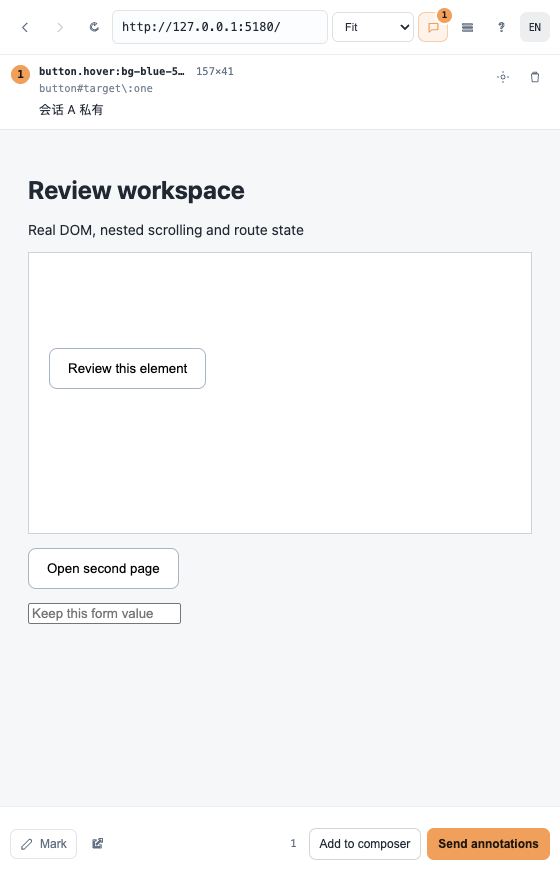

# dsh-annotate

**English** | [简体中文](README.zh-CN.md)

[](https://github.com/alaliqing/dsh-annotate/actions/workflows/ci.yml)
[](LICENSE)
[](package.json)

<!-- Restore this badge once 0.1.0 is published, otherwise it renders as a red
     "package not found": [](https://www.npmjs.com/package/dsh-annotate) -->

**Point at the UI, not at the code.** Open a local app you are already running,
click the elements you want changed, write a note on each, and send the whole
review to the conversation as one structured block — selectors, component names,
geometry and computed styles included, so the agent does not have to guess which
button you meant.

It is a normal sidebar tab in the DeepSeek Harness web client, not a separate
window you have to keep in sync by hand:

```
  ⌘⇧B  →  pick a running local service  →  click an element  →  write a note
        →  Send annotations (or Add to composer)
```



*The toolbar, the in-flow annotation list, and a marker on a picked element.
Captured from the test fixture; regenerate with `npm test`.*

> **Status: pre-1.0, not on npm yet.** The first release has not been published,
> so install from a checkout (§[Install](#install)). The `v0.1.0` release
> workflow is already in place.

## What it does

- **Finds your dev server by itself.** Every loopback service that is actually
  answering is listed with its page title — no configuration, no port guessing.
  The list refreshes every five seconds while it is visible, and IPv6-only
  servers are found too.
- **Opens it in a preview whose DOM can be read.** Each app gets its own isolated
  loopback origin, which is what makes element picking possible at all, while the
  app keeps its own paths so its assets and routes still work.
- **Keeps markers on their element.** They follow through window and nested
  scrolling, resizing and layout shifts, and hide rather than drift when the
  element is clipped or gone.
- **Sends evidence, not a screenshot.** The payload carries the selector and how
  many elements it matches, semantic anchors, the component chain, geometry and
  the computed values that matter. See
  [what gets sent](#what-gets-sent).
- **Never touches your draft.** *Send annotations* sends only the review; *Add to
  composer* merges it into what you are already writing. A rejected send keeps
  the annotations, and unrelated text and attachments are never sent.
- **English and Chinese**, switched in the toolbar and remembered per browser.

## Requirements

- A **DeepSeek Harness** web client you can restart. The harness packages
  (`@deepseek-ai/dsh-*`) are public on npm.
- The harness must run on **Node.js 20+**.
- **Chromium** is the validated browser (see [limits](#limits)).

`dsh-annotate` itself has no runtime dependencies, and the built files are
committed, so installing it needs no build step.

## Install

### From a checkout (works today)

```sh
git clone https://github.com/alaliqing/dsh-annotate
cd ~/.dsh/profiles/web
npx --yes pnpm@10 add "link:/absolute/path/to/dsh-annotate/packages/dsh-annotate"
```

### From npm (once 0.1.0 is published)

```sh
dsh plugin --profile web add dsh-annotate    # requires pnpm on PATH
```

### Both cases: enable it and restart

Add the plugin to that profile's `cordis.patch.yml`:

```yaml
- insert:
    - name: dsh-annotate
```

Then restart `dsh web`. The plugin registers a sidebar tab, a header button and a
`⌘/Ctrl⇧B` shortcut (with `⌘/Ctrl⇧A` as an alias).

## Review a local app

1. Start the project's own dev server, the way you normally would. The plugin
   only ever opens servers you started — it never launches or kills one.
2. Open a **conversation** (the sidebar and header button only exist once one is
   open), then press `⌘/Ctrl⇧B` or use the **Annotate** header button.
3. Pick a detected service from the list, or type `5173`, `localhost:3000/path`,
   or any loopback URL.
4. Press **Mark**, click an element, and write your note.

   | Key | Effect |
   | --- | --- |
   | `Enter` | Save and keep marking |
   | `Shift+Enter` | Newline |
   | `Esc` | Cancel the editor and leave marking mode |
   | `⌘/Ctrl`+click | Save this note and send the whole batch at once |

   Confirming a Chinese IME candidate is not treated as a save.
5. Choose **Add to composer** to fold the review into your draft, or **Send
   annotations** to send it on its own.

Sending goes through the addressed harness session and waits for acceptance. If
the agent is busy, the review queues. To fix an earlier note, click its marker,
or open the **annotations** button for an in-flow list that can locate and delete
comments without covering the preview. Deletion can be undone.

Annotations and in-progress drafts are scoped to the harness session **plus the
full app URL**, so SPA routes restore independently and two conversations never
see each other's notes. They survive a reload, and old `v1` records are left
untouched rather than guessed into an unrelated session.

## What gets sent

One block per review, in the panel's current language. A two-element review looks
like this (the style lines are long in reality; they are single lines, not
wrapped):

```
🎯 UI annotations · /settings · viewport 1440×900 (2)
#1 button.primary   component: SubmitButton
   semantics: aria-label="Save changes" · data-testid=save
   component chain: SettingsPage > SettingsForm > SubmitButton
   selector: #root > form > button.primary (matches: 1)
   position/size: 96×32 @ (640, 512) · viewport center (45%W × 59%H)
   computed styles: display:inline-block; padding:8px 16px; font-size:14px; font-weight:600; line-height:20px; color:rgb(255, 255, 255); background-color:rgb(109, 74, 255); border-radius:8px; width:96px; height:32px
   text: Save changes
   note: Disable this until the form is dirty.

#2 input.email   component: EmailField
   semantics: aria-label="Email" · name=email
   selector: #root > form > input.email (matches: 1)
   position/size: 320×36 @ (480, 448) · viewport center (44%W × 52%H)
   computed styles: display:block; padding:8px 10px; font-size:14px; border-radius:6px; width:320px; height:36px
   note: Show the validation error inline instead of as a toast.
```

| Field | Where it comes from |
| --- | --- |
| Location | The app URL, the page, the viewport, and the element's coarse zone in it |
| Identity | An escaped CSS selector plus how many elements it matches, the tag, the first class |
| Semantic anchors | `role`, `aria-label`, `alt`, `name` and `data-testid`/`data-test`/`data-test-id`/`data-qa` when present |
| Component | Nearest React component name and up to three levels of chain — needs a development build, since production names are minified |
| Geometry | Rounded width × height and position |
| Styles | 14 computed values, in a fixed order — evidence, not a style editor |
| Text | The element's visible text, collapsed and clipped to 120 characters |
| Note | Your comment |

No screenshot is taken and no style is changed by the payload.

## How the preview works

The problem worth knowing about: a page served from `http://127.0.0.1:5173` is a
different origin from the harness, and a cross-origin iframe's DOM cannot be read
— so no overlay can annotate it. The plugin gives **each session/app its own
ephemeral loopback origin**, deliberately on the opposite hostname from the
harness:

- The browser sees the app's own paths (`/settings` stays `/settings`), so
  root-absolute scripts, styles, SPA routes and WebSocket upgrades work with no
  path prefix and no `<base>` rewriting.
- The host injects a shim (for URLs built from the page's own origin, and for
  sockets) plus the picking overlay into every HTML document.
- Panel and overlay talk only over `postMessage`, checked on both sides by source
  **and** origin. The panel never reaches into the preview's DOM.
- Targets are restricted to `localhost`, `127.0.0.1` and `[::1]` — for HTTP and
  for WebSocket upgrades. External hosts, credentials in the URL, and the harness
  itself are rejected.
- App cookies are namespaced and sent as `SameSite=None; Secure; Partitioned`;
  non-prefixed cookies are stripped in both directions.
- Preview servers and their sockets close when the plugin is disposed; at most 24
  session/app previews are kept per boot.

An earlier design proxied the app under a path prefix on the harness origin. It
was removed rather than kept behind a flag: it isolated nothing, and it exposed
an unauthenticated WebSocket tunnel to any loopback port on the harness origin.

## Limits

This is a local development preview, not a general-purpose browser. Known
boundaries, and what you see when you hit one:

| Limit | What happens |
| --- | --- |
| OAuth redirects, origin allowlists, hard-coded origins, service workers | Need app-specific setup, or a normal browser |
| An HTTPS upstream with an untrusted certificate | A visible error; certificate validation is never silently disabled |
| A CSP that forbids inline scripts | Injection can be blocked; the panel reports the failure |
| Shadow DOM internals, cross-origin child frames | Not selectable |
| Canvas contents | The canvas is selectable as one element, not its drawn objects |
| Non-Chromium browsers | Partitioned cookies are only validated on Chromium; other engines differ |
| A remote harness, an HTTPS reverse proxy, or reaching this machine's loopback from another computer | Out of scope for a local-only design |
| Trust | The preview is trusted local code, not a security boundary between you and the app you chose to preview |

## Troubleshooting

| Symptom | Cause and fix |
| --- | --- |
| `⌘⇧B` and the header button do nothing | No conversation is open yet, so the sidebar has not materialized. Open one first. |
| The list says no services were found | Nothing is listening on a probed port. Start your dev server, or type the port in the box. The default probe list is 5173, 3000, 4173, 5180, 8080, 8000, 5000, 5500, 9000, 3001, 1234, 4200, 4321, 5174, 6006, 7000, 8001 and 8888; add yours with `detect.extraPorts`. |
| The preview never renders, no overlay appears | The app's dev CSP forbids inline scripts. Loosen it for development, or use a normal browser. |
| "Only local development services can be previewed" | You typed an external URL. Loopback only, by design. |
| A marker stopped following its element | The app removed or replaced it. The marker hides; delete the note and re-annotate. |
| A send is refused | The harness session did not accept it. The annotations are kept and nothing else in the composer was touched — retry when the agent is free. |
| Fonts or assets 404 in the preview | The app builds absolute URLs from an origin allowlist. See [limits](#limits). |

## Configuration

Optional — the panel needs none of this.

```yaml
- insert:
    - name: dsh-annotate
      config:
        detect:
          extraPorts: [4321]     # always probe these, beyond the default list
          probeTimeoutMs: 900    # per-port HTTP probe budget
          cacheMs: 2000          # how long a scan result is reused
          staticPorts: false     # true (the default) also probes the default list
```

There is also a host API for starting a dev server (`command` or `argv`, plus
`port`, `base`, `readyTimeoutMs`). It is for programmatic integrations only: the
panel exposes no start/stop control and never calls it, so configuring it changes
nothing in the UI.

## `dsh-app-bridge`

A second, deliberately small package in this repository, for the case where an
app must be mounted at a **fixed path on the harness origin** — typically a dev
server that is already base-prefixed (`vite --base=/app/`) and cannot be served
any other way.

```sh
cd ~/.dsh/profiles/web
npx --yes pnpm@10 add "link:/absolute/path/to/dsh-annotate/packages/dsh-app-bridge"
```

```yaml
- insert:
    - name: dsh-app-bridge
      config:
        target: http://127.0.0.1:5180   # must be a loopback http(s) URL
        prefix: /app                    # where it appears on the harness origin
        # wsPaths: ['/app/', '/app']    # optional; defaults to both spellings
        # forwardCredentials: false     # the default; see below
```

It registers one prefix route (streamed both ways, so SSE works) and HTTP upgrade
routes for the dev server's WebSocket. Because the bridged app shares the harness
origin, the harness's cookies and `Authorization` header would be visible to it
and its `Set-Cookie` would land on the harness origin — so credentials are
stripped in both directions unless you opt in with `forwardCredentials: true`.

It is a proxy and nothing more: it injects no script. Prefer the ordinary
`dsh-annotate` preview, which shares no origin with the harness at all.

## Uninstall

Remove the `- name: dsh-annotate` entry from the profile's `cordis.patch.yml` and
the dependency, then restart:

```sh
cd ~/.dsh/profiles/web
npx --yes pnpm@10 remove dsh-annotate
```

Saved annotations live in browser storage (keys prefixed `dsh-review:v2:` on the
harness origin and `dsh-annotate:v2:` on the preview origin). Dropping the
workspace's storage clears them.

## Development

```sh
npm ci
npx playwright install chromium
npm run check   # build lib/, parse every file, validate the i18n catalog
npm test        # packaging guard + assertion-based Chromium suite
```

`npm test` starts disposable loopback services and drives the **real built
client, shim and overlay** through a React fixture — currently 26 assertions
covering discovery, origin isolation, path preservation, cookie/fetch/WebSocket
round-trips, Chinese IME, nested wheel scrolling, clipping, layout shifts, route
and session separation, rejected and accepted sends, attaching, the language
switch and narrow layouts. No model is called. Screenshots land in the ignored
`tests/shots/`.

For a live harness, `node scripts/dev.mjs` seeds a throwaway profile and runs the
bundled fixture against it.

| Path | What it is |
| --- | --- |
| `packages/dsh-annotate/` | The plugin: host half, client half, injected shim and overlay |
| `packages/dsh-app-bridge/` | The fixed-mount reverse proxy |
| `examples/demo-app/` | Dependency-free fixture used by the dev loop and the tests |

`packages/dsh-annotate/lib/` is generated from `src/` **and committed** (the
harness loads those files directly), so run `npm run build` and include the
result in the same commit. CI fails if it drifts.

## Contributing

Issues and pull requests are welcome — see [CONTRIBUTING.md](CONTRIBUTING.md) for
the build rule above, the test expectations, and the message catalog rules. For a
security problem, follow [SECURITY.md](SECURITY.md) instead of opening a public
issue.

## License

[MIT](LICENSE), with third-party attribution in [NOTICE](NOTICE).

This is an independent plugin. It is not affiliated with, endorsed by, or
sponsored by DeepSeek; *DeepSeek* and *DeepSeek Harness* belong to their owners.
