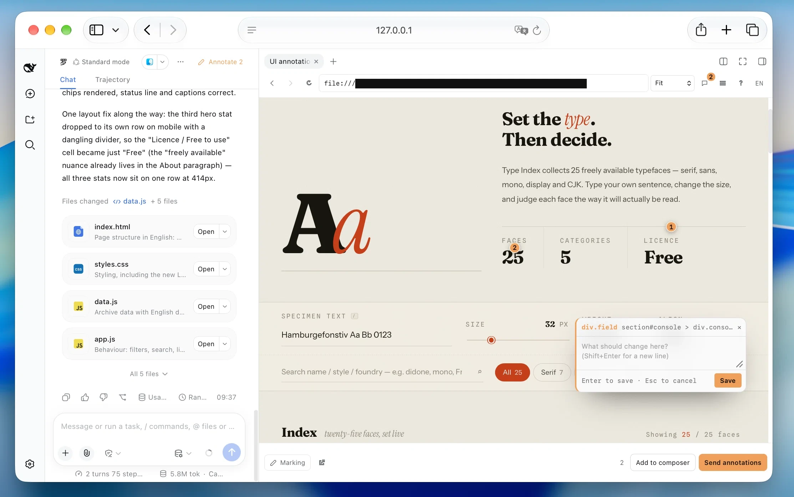

<div align="center">

# dsh-annotate

[English](README.md) · **简体中文**

[](https://github.com/alaliqing/dsh-annotate/actions/workflows/ci.yml)
[](https://www.npmjs.com/package/dsh-annotate)
[](LICENSE)
[](package.json)

**直接指出界面问题，把准确上下文交给编程助手。**

</div>

`dsh-annotate` 为 DeepSeek Harness 网页端增加了一个可视化评审面板。打开本地应用，
点选想改的元素，逐条留下意见，再把整份评审以结构化文本发进当前对话。



```text
⌘/Ctrl ⇧ B → 选择本地应用 → 标记 → 点选 → 写批注 → 发送
```

## 快速开始

### 交给编程助手

把下面这段话交给能访问 Harness 所在电脑的编程助手：

```text
请为本机 DeepSeek Harness 的 web profile 安装 dsh-annotate。
1. 确认 Node.js 20+、pnpm 和当前网页端使用的 dsh CLI 可用，然后运行 `dsh plugin --profile web add dsh-annotate`。如果网页端通过 `npx @deepseek-ai/dsh` 启动，下文命令也用它代替 `dsh`。
2. 当前包还需要手动启用。保留 `$DSH_HOME/profiles/web/cordis.patch.yml`（默认 `~/.dsh/profiles/web/cordis.patch.yml`）里的已有内容。只在没有 dsh-annotate 时增加一个顶层 `- insert:` 项，子项为 `- name: dsh-annotate`。
3. 运行 `dsh --profile web --dump-config`，确认结果中出现 dsh-annotate，并报告安装和配置检查结果。
4. 不要直接结束正在使用的 Harness 会话。告诉我重启 web profile、刷新浏览器后，可以通过 ⌘/Ctrl⇧B 或对话顶部的「标注」按钮打开面板。
```

### 手动安装

需要 Node.js 20+、`dsh` CLI，以及 `PATH` 中可用的 pnpm。Chromium 是已通过
完整测试的浏览器。如果你通过 `npx @deepseek-ai/dsh web` 启动 Harness，
把下文命令中的 `dsh` 换成 `npx @deepseek-ai/dsh`。

```sh
dsh plugin --profile web add dsh-annotate
```

当前包会作为依赖安装，不会自动作为 Harness bundle 启用。打开
`$DSH_HOME/profiles/web/cordis.patch.yml`（通常是
`~/.dsh/profiles/web/cordis.patch.yml`），保留现有配置，增加以下条目；
如果已经存在，就不要重复添加：

```yaml
- insert:
    - name: dsh-annotate
```

检查实际生效的配置：

```sh
dsh --profile web --dump-config
```

确认输出中出现 `dsh-annotate`，然后重启 web profile、刷新浏览器。
打开一个对话，点击顶部的**标注**按钮，或按 `⌘/Ctrl⇧B`。
如果正在 Harness 对话中安装，请先完成配置，再重启该会话。

### 使用尚未发布的检出

如果要使用尚未发布的检出，而不是 npm 包，把它链接进 profile：

```sh
git clone https://github.com/alaliqing/dsh-annotate.git
cd "${DSH_HOME:-$HOME/.dsh}/profiles/web"
npx --yes pnpm@10 add "link:/绝对路径/dsh-annotate/packages/dsh-annotate"
```

然后按上面的方式启用并检查配置。已用未发布检出的打包产物，在 Harness CLI
`0.1.5-rc.2`、网页端和会话控制器 `0.1.5-rc.3` 上完成真实接入验证；这次验证
没有安装 npm `0.1.1`。环境和验证边界见[兼容性记录](docs/compatibility.md)。

## 核心能力

- **零配置发现**正在运行的本地开发服务器，同时支持 IPv4 和 IPv6，并优先列出属于当前
  工作区的服务。
- **静态页面无需服务器：** 工作区里的 `index.html`，或 `dist/`、`build/`、`out/`、
  `public/` 下已构建的页面，会直接列出，并以所在目录为根进行预览。
- **元素级上下文：** CSS 选择器及命中数量、语义属性、React 组件链、几何信息、
  计算样式和可见文本。
- **始终跟随元素的标记：** 支持窗口滚动、内层滚动、尺寸变化和布局位移。
- **两种明确的发送方式：** 单独发送评审，或加入当前草稿；发送失败也不会丢批注。
- **彼此隔离的预览：** 保留应用路由、资源、fetch 和 WebSocket，同时不与 Harness 共用源。
- **中英双语界面**，可在工具栏切换。

插件不会截图，也不会修改应用样式。默认只发现你已经运行的服务器；只有显式配置了
启动命令，才会启用进程控制。

## 使用

1. 启动应用的开发服务器。
2. 打开一个 Harness 对话，然后按 `⌘/Ctrl⇧B` 或点击顶部的**标注**按钮。
3. 选择检测到的服务、工作区内的静态页面，或手动输入端口/回环 URL。
4. 点击**标记**，点选元素并写下意见。
5. 选择**加入输入框**或**发送批注**。

| 按键 | 操作 |
| --- | --- |
| `Enter` | 保存并继续标记 |
| `Shift+Enter` | 换行 |
| `Esc` | 取消并退出标记模式 |
| `⌘/Ctrl` + 点击 | 保存并发送整批内容 |

批注和草稿按 Harness 会话与完整应用 URL 存储，因此不同路由可以独立恢复，
不同会话也不会串数据。

列表按“有多大概率是你自己的”排序：进程启动目录落在当前对话工作区内的服务会打上
**当前项目** 标签，工作区在 `package.json` 或 Vite 配置里声明过的端口会打上
**配置端口** 标签，之后才按常见端口顺序排列。静态页面单独成段；当候选只有一个时会
自动打开——只有在完全没有任何服务运行时，才轮到静态页面。

## 模型会收到什么

```text
🎯 界面标注 · /settings · 视口 1440×900（1 条）
#1 button.primary  组件: SubmitButton
   语义: aria-label="保存修改" · data-testid=save
   组件链: SettingsPage > SettingsForm > SubmitButton
   选择器: #root > form > button.primary（命中 1 个元素）
   位置/尺寸: 96×32 @ (640, 512) · 视口 正中
   当前样式: display:inline-block; padding:8px 16px; …
   文本: 保存修改
   批注: 表单没有变化时，这个按钮应该禁用。
```

React 组件名需要开发构建才能可靠获取；可见文本最多保留 120 个字符。

## 预览隔离

普通跨源 iframe 无法暴露 DOM。`dsh-annotate` 不会把应用搬到 Harness 源上，
而是为每个会话/应用组合创建独立的临时回环源，并注入一层很小的 shim 和点选覆盖层。

- 面板与覆盖层通信时同时校验消息来源和源站。
- 目标仅允许 `localhost`、`127.0.0.1` 和 `[::1]`。
- 静态页面由插件自身以只读方式、在所在目录上以回环源提供：仅允许 `GET`/`HEAD`，
  不越出工作区，不提供点文件，单文件上限 64 MiB。
- 应用 cookie 带独立命名空间；没有前缀的 cookie 会在两个方向都被移除。
- 关闭面板、返回服务列表或切换应用时会释放对应预览；其他窗口仍在使用的预览会保留。
  异常退出后，五分钟没有活动或续期的预览会被回收；插件销毁时关闭所有剩余服务和 socket。

这是本地开发工具，不是浏览器沙箱。OAuth、严格源白名单、Service Worker、限制性 CSP、
Shadow DOM 内部、跨源子 frame 和 Canvas 内部对象，可能需要正常浏览器或应用专门配置。
完整 cookie 模型目前只在 Chromium 上验证过。

## 可选配置

```yaml
- insert:
    - name: dsh-annotate
      config:
        detect:
          extraPorts: [4321]
          probeTimeoutMs: 900
          cacheMs: 2000
          staticPorts: false
          staticFiles: false
```

`detect.staticPorts: false` 会停止盲扫常见端口，只保留真实监听；`detect.staticFiles:
false` 不再列出工作区里的静态页面；`detect.extraPorts` 用于补充习惯使用的端口。

仓库还包含 [`dsh-app-bridge`](packages/dsh-app-bridge/README.md)，用于必须把应用挂载到
Harness 源固定路径下的少数情况。它只是反向代理，不提供批注界面。

## 开发

```sh
npm ci
npx playwright install chromium
npm run check
npm test
```

默认测试会在 Chromium 中驱动真实的 client、shim 和 overlay 构建产物，使用 Harness
测试替身，不调用模型。`npm run test:harness` 则在独立的真实 Harness 中安装打包产物，
使用本地模型替身验证完整接入。`packages/dsh-annotate/lib/` 下的生成文件会提交到仓库，
必须与源码保持同步。

仓库约定见 [CONTRIBUTING.md](CONTRIBUTING.md)；安全问题请按
[SECURITY.md](SECURITY.md) 私下报告。

## 许可证

[MIT](LICENSE)，第三方归属见 [NOTICE](NOTICE)。

这是独立的社区插件，与 DeepSeek 没有隶属或背书关系。
